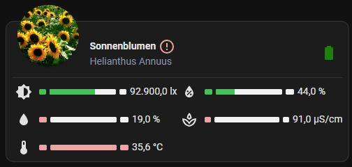

# Plants

## Custom components

- [Flower Card](https://github.com/Olen/homeassistant-plant)
- [OpenPlantbook](https://github.com/Olen/home-assistant-openplantbook)
- [Custom Plant integration](https://github.com/Olen/homeassistant-plant)

## Devices

Currently I'm using the MiFlora devices. They are often rebranded.
My Devices:

- [Royal Gardineer](https://amzn.to/3WJIZxP) (Affiliate link)

## Lovelace

