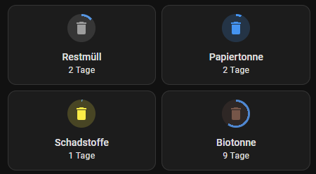

---
---

# Waste

> For managing the waste collection I use the "[AbfallPlus](https://github.com/bouni/abfallplus)" integration. This integration is available in the HACS. 

## Configuration

```yaml
---
# Restmüll
platform: abfallplus
name: Restmüll
key: !secret abfall_key
municipality: !secret abfall_municipality
street: !secret abfall_street
trash_ids: "31"
```

## UI



::: code-group
```yaml	[Dashboard integration]
type: custom:decluttering-card
template: waste_card_template
variables:
    - entity: sensor.restmull
    - title: Restmüll
    - max_days: 15
```

```yaml [Decluttering card template]
---
# Waste Card
waste_card_template:
  default:
    - icon: mdi:delete
    - icon_open: mdi:delete-empty
    - title: Abfall
    - max_days: 30
    - icon_color: grey
    - layout: vertical
  card:
    type: custom:mushroom-template-card
    icon: |
      
      [[icon_open]]
      
      [[icon]]
      
    primary: "[[title]]"
    icon_color: "[[icon_color]]"
    layout: "[[layout]]"
    secondary: >-
      {{ state_attr(entity, "remaining") }}
      Tage
    entity: "[[entity]]"
    card_mod:
      style:
        mushroom-shape-icon$: |
          .shape {
            background: radial-gradient(var(--card-background-color) 60%, transparent 0%), conic-gradient(rgb(var(--rgb-blue)) {{ state_attr(config.entity, "remaining") / [[max_days]] * 100 }}% 0%, var(--card-background-color) 0% 100%);
          }
          .shape:after {
            content: "";
            height: 100%;
            width: 100%;
            position: absolute;
            border-radius: 50%;
            background: rgba(var(--rgb-{{ config.icon_color }}), 0.2);
          }
    tap_action:
      action: more-info

```
:::


## Automation

In the following automation, a notification is sent when the waste collection is due. One notification on the day of the collection and one notification the day before.
The mode `parallel` is used to send both notifications at the same time. Cause some times the different waste collections are on the same day.

```yaml	
---
alias: Abfallbenachrichtigung
id: <uid>
description: "Benachrichtigt wenn Abfall abgeholt wird."
trigger:
  - platform: state
    entity_id:
      - sensor.restmull
      - sensor.papiertonne
      - sensor.schadstoffe
    attribute: remaining
    to: 0
    id: heute
  - platform: state
    entity_id:
      - sensor.restmull
      - sensor.papiertonne
      - sensor.schadstoffe
    attribute: remaining
    to: 1
    id: morgen

condition: []
action:
  - service: script.notify_engine
    data:
      title: |
        🗑️ Abfall 🗑️
      value1: |
        {{ trigger.to_state.attributes.friendly_name }} wird {{ trigger.id }} abgeholt.
      value2: |
        {{ trigger.to_state.attributes.description }}
      who: "home"
      tag_id: "information"
      group: "Abfall"
mode: parallel
```
