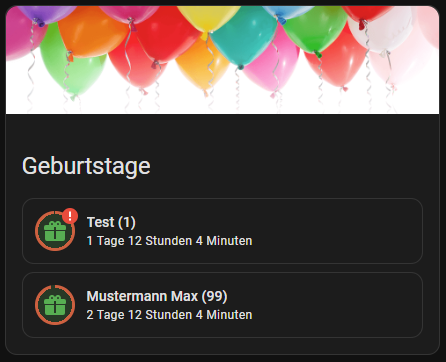

---
---

# Birthdays

## With anniversary custom component

This uses the [Anniversaries Component](https://github.com/pinkywafer/Anniversaries) and the [auto-entities card](https://github.com/thomasloven/lovelace-auto-entities) to display the next 3 birthdays.



```yaml
type: custom:auto-entities
filter:
    include:
    - entity_id: sensor.anniversary_birthday*
        options:
        type: custom:mushroom-template-card
        icon: mdi:gift
        primary: |
            {{ state_attr(entity, 'friendly_name') }} ({{state_attr(entity, 'years_at_anniversary') }})
        icon_color: green
        secondary: |
            
            
            
            
            {%- set days = delta.days % 7 %}
            
            {%- set minutes = (delta.seconds % 3600) // 60 %}
            {{- "{} Wochen ".format(weeks) if weeks > 0 else "" -}}
            {{- "{} Tage ".format(days) if days > 0 else "" -}}
            {{- "{} Stunden ".format(hours) if hours > 0 else "" -}}
            {{- "{} Minuten ".format(minutes) if minutes > 0 else "" -}}
        badge_icon: |-
            
            
            mdi:exclamation-thick
            
        badge_color: red
        tap_action:
            action: more-info
        card_mod:
            style:
            mushroom-shape-icon$: |
                .shape {
                background: radial-gradient(var(--card-background-color) 60%, transparent 0%), conic-gradient(rgb(var(--rgb-red)) {{ (365-int(states(config.entity)))/365*100 }}% 0%, var(--card-background-color) 0% 100%);
                }
                .shape:after {
                content: "";
                height: 100%;
                width: 100%;
                position: absolute;
                border-radius: 50%;
                background: rgba(var(--rgb-{{ config.icon_color }}), 0.2);
                }
    exclude: []
sort:
    method: state
    reverse: false
    numeric: true
    count: 3
show_empty: false
card:
    type: entities
    show_header_toggle: false
    title: Geburtstage
    state_color: false
    header:
    type: picture
    image: >-
        https://www.home-assistant.io/images/lovelace/header-footer/balloons-header.png
    tap_action:
        action: none
    hold_action:
        action: none
```

## with an ics calendar

A normal calendar e.g. Google Calendar is used to store the birthdays in.

| Pros                                    | Cons                                     |
| --------------------------------------- | ---------------------------------------- |
| Uses google contacts to add the entries | age is not displayed                     |
|                                         | currently only one birthday is displayed |

```yaml
type: conditional
conditions:
    - entity: calendar.geburtstage
    state: "on"
card:
    type: custom:mushroom-template-card
    icon: mdi:gift
    icon_color: deep-orange
    primary: |-
    {{ state_attr("calendar.geburtstage","message") }}
    card_mod:
    style:
        mushroom-shape-icon$: |
        ha-icon {
            --icon-animation: surprise 3s ease infinite;
        }
        @keyframes surprise {
            0%, 20%, 100% { transform: translateY(0); }
            2.5% { transform: translateY(-6px) rotate(-14deg); }
            5% { transform: translateY(-6px) rotate(11deg); }
            7.5% { transform: translateY(-6px) rotate(-8deg); }
            10% { transform: translateY(-6px) rotate(5deg); }
            12.5% { transform: translateY(0); }
            15% { transform: translateY(-3px) }
        }
```
